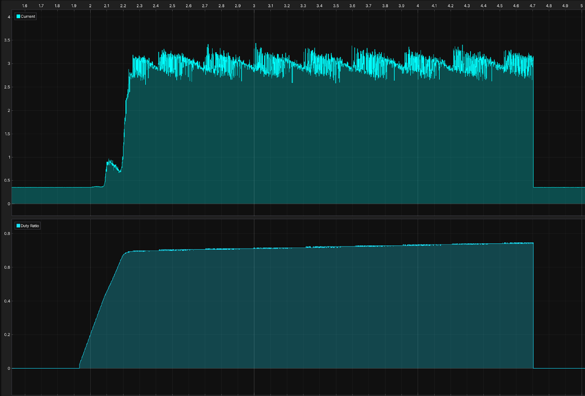

# Overcurrent (OC) Protection and System Evaluation

## OC Threshold

Noise on the current measurement makes accurate threshold determination impossible.  
However, the threshold is **certainly above 12.5 A**.

---

## OC Propagation Delay (OC PC Delay)

### Required Maximum Delay @ 50 VDC

- Itrip = 13 A
- Imax = 260 A @ 300 µs

$$
\frac{dI}{dt} = \frac{V_{DC}}{L} = 22 \tfrac{A}{µs}
$$

$$
t_{pd, max} = \frac{I_{max} - I_{trip}}{dI/dt} = \frac{240 A}{22 A/µs} = 10 µs
$$

> **Note:**  
> This calculation assumes constant inductance (**L**).  
> However, **L decreases with saturation (~7 A)**, making the OCP potentially **useless or too slow**.

> **Reference:**  
> Short Circuit Withstand Times for various EPC devices were evaluated [here](https://epc-co.com/epc/portals/0/epc/documents/product-training/Reliability%20Report%20Phase%2011.pdf). All measured withstand times were **> 5µs**.

---

## Theoretical Delay Breakdown

| Component | Bandwidth / Spec | Delay (tpd) |
|------------|------------------|------------|
| Current Sensor | 1 MHz | 0.8 µs (5τ) |
| Differential Amplifier | GBW = 1 MHz | 0.8 µs |
| Non-Inverting Amplifier | BW = 10 MHz | 0.08 µs |
| Comparator | With deglitch capacitor | 1 µs |
| D-FF | CLK → Q | 7 ns |
| 2× OR-Gate | — | 12 ns |
| Programmable Gate | — | 6 ns |
| Gate Driver | — | 45 ns |

**→ Total theoretical delay:**

tpd,tot ≈ 1.75 µs

---

## Measurement Procedure

### Without Exact Threshold Measurement
Measure **propagation delay** from **after the comparator** to **gate-low**,  
then **add theoretical delay**. The Tests are performed **after removing the deglitch capacitor**.

---

## Measurement Results

- **Measured propagation delay (after comparator → gate-off):** 70 ns  
- **Expected total delay:** ≈ 2 µs

---

## E-Stop and Disable Delay

*(No measurement data provided.)*

---

## Precharge Tracking

### Setup

- Input: **30 V** DC power supply  
- Output: **6 F capacitor bank** with **15 Ω resistor** in parallel  
- Load: nearly constant (essentially a short circuit)  
- Reference step: **3 A**  
- Controller gains:  
  - KP = 0.01
  - KI = 1

### Observations

- Controller **tracks the reference** even with weak gains.  
- Increasing gains could **damage the device**, since OCP functionality is **not yet verified**.  
- **Sawtooth error** may result from **aliasing of ripple current**, which can be reduced by using a **larger inductor**.

### Notes

- An **offset of 0.35 A** was applied empirically.  
- Likely due to **zero-current reference voltage error**, causing the **difference amplifier to clamp to zero**.

---

## Continuous Precharge

### Setup

Same setup as used for **Precharge Tracking**.

### Results

- After a few seconds, the **synchronous rectifier** of the buck converter **failed permanently**.  
- Failure results in a **short circuit between the switching node and GND**.

### Possible Cause

- **Inductance decrease** due to:  
  - **Thermal effects**, and/or  
  - **Current saturation**

### Solutions

- Use a **larger inductor** to mitigate both thermal and saturation issues.

---

## Thermal, Accuracy, and Ripple

*(Section not yet detailed.)*

---

## Continuous Bypass Thermal

### Setup
A large resistive load (~1Ω) was connected at the output terminal. Then, the bypass FETs are closed and current starts flowing. The temperature is measured using a FLIR camera. No cooler is used.

### Results
At a continuous current of  15A, the temperature settles at ~65°C. At 20A, the temperature quickly rises above 100°C. So, for continuous bypass at >20A, a cooler is needed.

---
## Isolation Test
### Procedure
Use Insulation Tester at inceasing Voltages between the two isolated GNDs. For each voltage (125V, 250V, 500V, 1kV), the insulation voltage is applied for 5s. At 1kV, a continuous test of 1min is also performed.
### Results
For each of the tested Voltages, the Insulation Resistance stays at **>2MΩ**. For the continuous test, the insulation resistance never decreased below **1.7MΩ**.

## Possibly Destructive Tests
- Startup sequence (**PWR before CTRL**)
- Maximum input voltage
